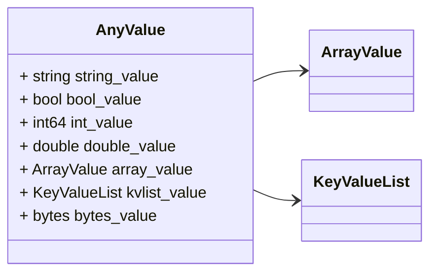
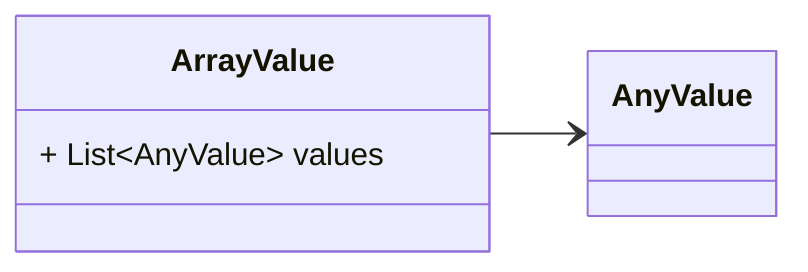
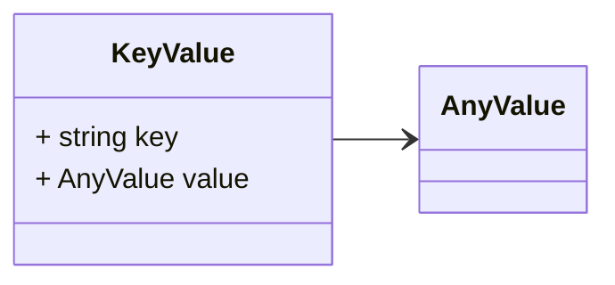
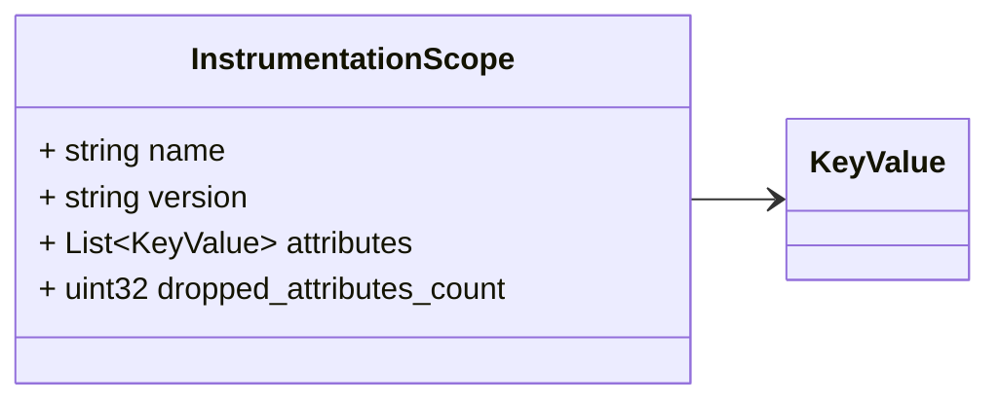

# Package: opentelemetry.proto.common.v1

Copyright 2019, OpenTelemetry Authors Licensed under the Apache License, Version 2.0 (the "License"); you may not use this file except in compliance with the License. You may obtain a copy of the License at http://www.apache.org/licenses/LICENSE-2.0 Unless required by applicable law or agreed to in writing, software distributed under the License is distributed on an "AS IS" BASIS, WITHOUT WARRANTIES OR CONDITIONS OF ANY KIND, either express or implied. See the License for the specific language governing permissions and limitations under the License. 

## Imports

| Import | Description |
|--------|-------------|

## Options

| Name                 | Value                                    | Description |
|----------------------|------------------------------------------|-------------|
| csharp_namespace     | OpenTelemetry.Proto.Common.V1            |             |
| java_multiple_files  | true                                     |             |
| java_package         | io.opentelemetry.proto.common.v1         |             |
| java_outer_classname | CommonProto                              |             |
| go_package           | go.opentelemetry.io/proto/otlp/common/v1 |             |

### AnyValue Diagram

### ArrayValue Diagram

### KeyValueList Diagram

### KeyValue Diagram

### InstrumentationScope Diagram

## Message: AnyValue

FQN: opentelemetry.proto.common.v1.AnyValue

AnyValue is used to represent any type of attribute value. AnyValue may contain a primitive value such as a string or integer or it may contain an arbitrary nested object containing arrays, key-value lists and primitives. 

| Field        | Ordinal | Type         | Label | Description                                                                                                                                   |
|--------------|---------|--------------|-------|-----------------------------------------------------------------------------------------------------------------------------------------------|
| string_value | 1       | string       |       | The value is one of the listed fields. It is valid for all values to be unspecified in which case this AnyValue is considered to be "empty".  |
| bool_value   | 2       | bool         |       |                                                                                                                                               |
| int_value    | 3       | int64        |       |                                                                                                                                               |
| double_value | 4       | double       |       |                                                                                                                                               |
| array_value  | 5       | ArrayValue   |       |                                                                                                                                               |
| kvlist_value | 6       | KeyValueList |       |                                                                                                                                               |
| bytes_value  | 7       | bytes        |       |                                                                                                                                               |

## Message: ArrayValue

FQN: opentelemetry.proto.common.v1.ArrayValue

ArrayValue is a list of AnyValue messages. We need ArrayValue as a message since oneof in AnyValue does not allow repeated fields. 

| Field  | Ordinal | Type     | Label    | Description                                                    |
|--------|---------|----------|----------|----------------------------------------------------------------|
| values | 1       | AnyValue | Repeated | Array of values. The array may be empty (contain 0 elements).  |

## Message: KeyValueList

FQN: opentelemetry.proto.common.v1.KeyValueList

KeyValueList is a list of KeyValue messages. We need KeyValueList as a message since `oneof` in AnyValue does not allow repeated fields. Everywhere else where we need a list of KeyValue messages (e.g. in Span) we use `repeated KeyValue` directly to avoid unnecessary extra wrapping (which slows down the protocol). The 2 approaches are semantically equivalent. 

| Field  | Ordinal | Type     | Label    | Description                                                                                                                                                                                     |
|--------|---------|----------|----------|-------------------------------------------------------------------------------------------------------------------------------------------------------------------------------------------------|
| values | 1       | KeyValue | Repeated | A collection of key/value pairs of key-value pairs. The list may be empty (may contain 0 elements). The keys MUST be unique (it is not allowed to have more than one value with the same key).  |

## Message: KeyValue

FQN: opentelemetry.proto.common.v1.KeyValue

KeyValue is a key-value pair that is used to store Span attributes, Link attributes, etc. 

| Field | Ordinal | Type     | Label | Description |
|-------|---------|----------|-------|-------------|
| key   | 1       | string   |       |             |
| value | 2       | AnyValue |       |             |

## Message: InstrumentationScope

FQN: opentelemetry.proto.common.v1.InstrumentationScope

InstrumentationScope is a message representing the instrumentation scope information such as the fully qualified name and version. 

| Field                    | Ordinal | Type     | Label    | Description                                                                                                                                                      |
|--------------------------|---------|----------|----------|------------------------------------------------------------------------------------------------------------------------------------------------------------------|
| name                     | 1       | string   |          | An empty instrumentation scope name means the name is unknown.                                                                                                   |
| version                  | 2       | string   |          |                                                                                                                                                                  |
| attributes               | 3       | KeyValue | Repeated | Additional attributes that describe the scope. [Optional]. Attribute keys MUST be unique (it is not allowed to have more than one attribute with the same key).  |
| dropped_attributes_count | 4       | uint32   |          |                                                                                                                                                                  |

<!-- Created by: Proto Diagram Tool -->
<!-- https://github.com/GoogleCloudPlatform/proto-gen-md-diagrams -->
