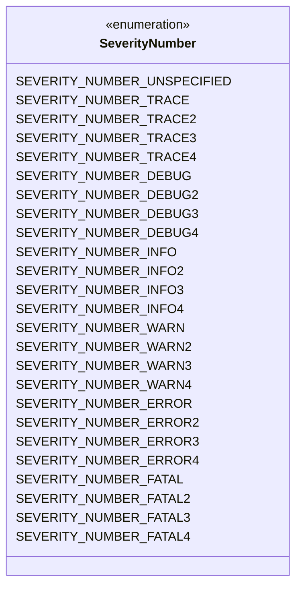
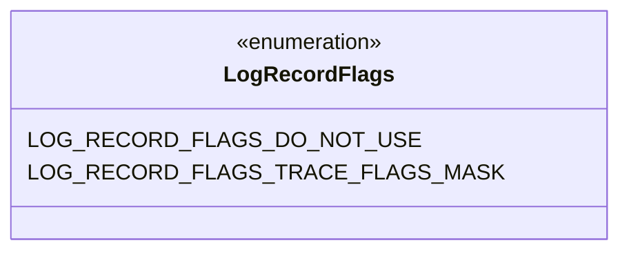
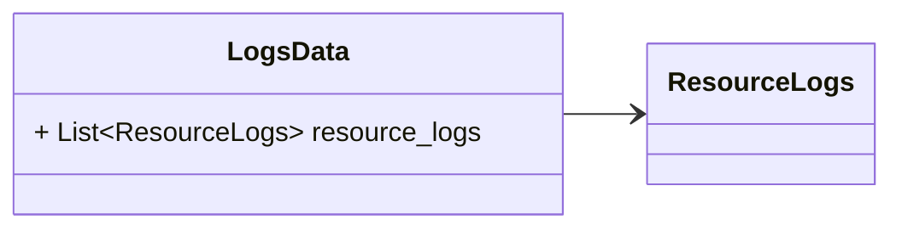
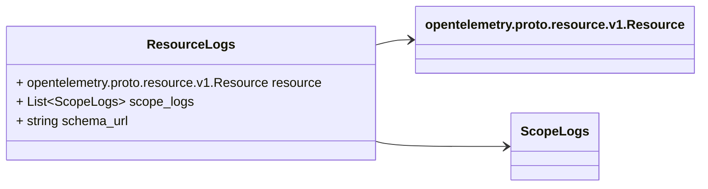
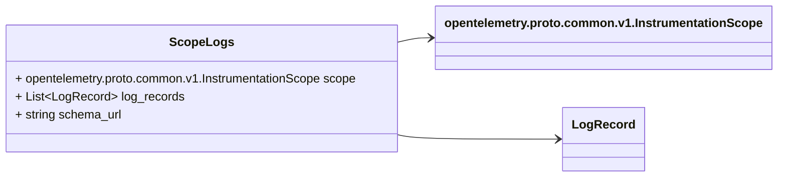
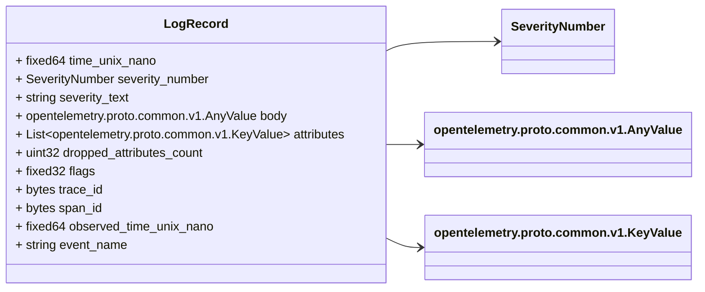

# Package: opentelemetry.proto.logs.v1

Copyright 2020, OpenTelemetry Authors Licensed under the Apache License, Version 2.0 (the "License"); you may not use this file except in compliance with the License. You may obtain a copy of the License at http://www.apache.org/licenses/LICENSE-2.0 Unless required by applicable law or agreed to in writing, software distributed under the License is distributed on an "AS IS" BASIS, WITHOUT WARRANTIES OR CONDITIONS OF ANY KIND, either express or implied. See the License for the specific language governing permissions and limitations under the License. 

## Imports

| Import                                         | Description |
|------------------------------------------------|-------------|
| opentelemetry/proto/common/v1/common.proto     |             |
| opentelemetry/proto/resource/v1/resource.proto |             |

## Options

| Name                 | Value                                  | Description |
|----------------------|----------------------------------------|-------------|
| csharp_namespace     | OpenTelemetry.Proto.Logs.V1            |             |
| java_multiple_files  | true                                   |             |
| java_package         | io.opentelemetry.proto.logs.v1         |             |
| java_outer_classname | LogsProto                              |             |
| go_package           | go.opentelemetry.io/proto/otlp/logs/v1 |             |

## Enum: SeverityNumber

FQN: opentelemetry.proto.logs.v1.SeverityNumber

Possible values for LogRecord.SeverityNumber. 

| Name                        | Ordinal | Description                                                      |
|-----------------------------|---------|------------------------------------------------------------------|
| SEVERITY_NUMBER_UNSPECIFIED | 0       | UNSPECIFIED is the default SeverityNumber, it MUST NOT be used.  |
| SEVERITY_NUMBER_TRACE       | 1       |                                                                  |
| SEVERITY_NUMBER_TRACE2      | 2       |                                                                  |
| SEVERITY_NUMBER_TRACE3      | 3       |                                                                  |
| SEVERITY_NUMBER_TRACE4      | 4       |                                                                  |
| SEVERITY_NUMBER_DEBUG       | 5       |                                                                  |
| SEVERITY_NUMBER_DEBUG2      | 6       |                                                                  |
| SEVERITY_NUMBER_DEBUG3      | 7       |                                                                  |
| SEVERITY_NUMBER_DEBUG4      | 8       |                                                                  |
| SEVERITY_NUMBER_INFO        | 9       |                                                                  |
| SEVERITY_NUMBER_INFO2       | 10      |                                                                  |
| SEVERITY_NUMBER_INFO3       | 11      |                                                                  |
| SEVERITY_NUMBER_INFO4       | 12      |                                                                  |
| SEVERITY_NUMBER_WARN        | 13      |                                                                  |
| SEVERITY_NUMBER_WARN2       | 14      |                                                                  |
| SEVERITY_NUMBER_WARN3       | 15      |                                                                  |
| SEVERITY_NUMBER_WARN4       | 16      |                                                                  |
| SEVERITY_NUMBER_ERROR       | 17      |                                                                  |
| SEVERITY_NUMBER_ERROR2      | 18      |                                                                  |
| SEVERITY_NUMBER_ERROR3      | 19      |                                                                  |
| SEVERITY_NUMBER_ERROR4      | 20      |                                                                  |
| SEVERITY_NUMBER_FATAL       | 21      |                                                                  |
| SEVERITY_NUMBER_FATAL2      | 22      |                                                                  |
| SEVERITY_NUMBER_FATAL3      | 23      |                                                                  |
| SEVERITY_NUMBER_FATAL4      | 24      |                                                                  |

## Enum: LogRecordFlags

FQN: opentelemetry.proto.logs.v1.LogRecordFlags

LogRecordFlags represents constants used to interpret the LogRecord.flags field, which is protobuf 'fixed32' type and is to be used as bit-fields. Each non-zero value defined in this enum is a bit-mask. To extract the bit-field, for example, use an expression like: (logRecord.flags & LOG_RECORD_FLAGS_TRACE_FLAGS_MASK) 

| Name                              | Ordinal | Description                                                                                                                           |
|-----------------------------------|---------|---------------------------------------------------------------------------------------------------------------------------------------|
| LOG_RECORD_FLAGS_DO_NOT_USE       | 0       | The zero value for the enum. Should not be used for comparisons. Instead use bitwise "and" with the appropriate mask as shown above.  |
| LOG_RECORD_FLAGS_TRACE_FLAGS_MASK | 0       | Bits 0-7 are used for trace flags.                                                                                                    |

### SeverityNumber Diagram

### LogRecordFlags Diagram

### LogsData Diagram

### ResourceLogs Diagram

### ScopeLogs Diagram

### LogRecord Diagram

## Message: LogsData

FQN: opentelemetry.proto.logs.v1.LogsData

LogsData represents the logs data that can be stored in a persistent storage, OR can be embedded by other protocols that transfer OTLP logs data but do not implement the OTLP protocol. The main difference between this message and collector protocol is that in this message there will not be any "control" or "metadata" specific to OTLP protocol. When new fields are added into this message, the OTLP request MUST be updated as well. 

| Field         | Ordinal | Type         | Label    | Description                                                                                                                                                                                                                                                                                |
|---------------|---------|--------------|----------|--------------------------------------------------------------------------------------------------------------------------------------------------------------------------------------------------------------------------------------------------------------------------------------------|
| resource_logs | 1       | ResourceLogs | Repeated | An array of ResourceLogs. For data coming from a single resource this array will typically contain one element. Intermediary nodes that receive data from multiple origins typically batch the data before forwarding further and in that case this array will contain multiple elements.  |

## Message: ResourceLogs

FQN: opentelemetry.proto.logs.v1.ResourceLogs

A collection of ScopeLogs from a Resource. 

| Field      | Ordinal | Type                                     | Label    | Description                                                                                                                                                                                                                                                                                                                                                                                                                                                                            |
|------------|---------|------------------------------------------|----------|----------------------------------------------------------------------------------------------------------------------------------------------------------------------------------------------------------------------------------------------------------------------------------------------------------------------------------------------------------------------------------------------------------------------------------------------------------------------------------------|
| resource   | 1       | opentelemetry.proto.resource.v1.Resource |          | The resource for the logs in this message. If this field is not set then resource info is unknown.                                                                                                                                                                                                                                                                                                                                                                                     |
| scope_logs | 2       | ScopeLogs                                | Repeated | A list of ScopeLogs that originate from a resource.                                                                                                                                                                                                                                                                                                                                                                                                                                    |
| schema_url | 3       | string                                   |          | The Schema URL, if known. This is the identifier of the Schema that the resource data is recorded in. Notably, the last part of the URL path is the version number of the schema: http[s]://server[:port]/path/<version>. To learn more about Schema URL see https://opentelemetry.io/docs/specs/otel/schemas/#schema-url This schema_url applies to the data in the "resource" field. It does not apply to the data in the "scope_logs" field which have their own schema_url field.  |

## Message: ScopeLogs

FQN: opentelemetry.proto.logs.v1.ScopeLogs

A collection of Logs produced by a Scope. 

| Field       | Ordinal | Type                                               | Label    | Description                                                                                                                                                                                                                                                                                                                                                                    |
|-------------|---------|----------------------------------------------------|----------|--------------------------------------------------------------------------------------------------------------------------------------------------------------------------------------------------------------------------------------------------------------------------------------------------------------------------------------------------------------------------------|
| scope       | 1       | opentelemetry.proto.common.v1.InstrumentationScope |          | The instrumentation scope information for the logs in this message. Semantically when InstrumentationScope isn't set, it is equivalent with an empty instrumentation scope name (unknown).                                                                                                                                                                                     |
| log_records | 2       | LogRecord                                          | Repeated | A list of log records.                                                                                                                                                                                                                                                                                                                                                         |
| schema_url  | 3       | string                                             |          | The Schema URL, if known. This is the identifier of the Schema that the log data is recorded in. Notably, the last part of the URL path is the version number of the schema: http[s]://server[:port]/path/<version>. To learn more about Schema URL see https://opentelemetry.io/docs/specs/otel/schemas/#schema-url This schema_url applies to all logs in the "logs" field.  |

## Message: LogRecord

FQN: opentelemetry.proto.logs.v1.LogRecord

A log record according to OpenTelemetry Log Data Model: https://github.com/open-telemetry/oteps/blob/main/text/logs/0097-log-data-model.md 

| Field                    | Ordinal | Type                                   | Label    | Description                                                                                                                                                                                                                                                                                                                                                                                                                                                                                                                                                                                                                                                                                                                                                                                                                                                                                                                                      |
|--------------------------|---------|----------------------------------------|----------|--------------------------------------------------------------------------------------------------------------------------------------------------------------------------------------------------------------------------------------------------------------------------------------------------------------------------------------------------------------------------------------------------------------------------------------------------------------------------------------------------------------------------------------------------------------------------------------------------------------------------------------------------------------------------------------------------------------------------------------------------------------------------------------------------------------------------------------------------------------------------------------------------------------------------------------------------|
| time_unix_nano           | 1       | fixed64                                |          | time_unix_nano is the time when the event occurred. Value is UNIX Epoch time in nanoseconds since 00:00:00 UTC on 1 January 1970. Value of 0 indicates unknown or missing timestamp.                                                                                                                                                                                                                                                                                                                                                                                                                                                                                                                                                                                                                                                                                                                                                             |
| severity_number          | 2       | SeverityNumber                         |          | Numerical value of the severity, normalized to values described in Log Data Model. [Optional].                                                                                                                                                                                                                                                                                                                                                                                                                                                                                                                                                                                                                                                                                                                                                                                                                                                   |
| severity_text            | 3       | string                                 |          | The severity text (also known as log level). The original string representation as it is known at the source. [Optional].                                                                                                                                                                                                                                                                                                                                                                                                                                                                                                                                                                                                                                                                                                                                                                                                                        |
| body                     | 5       | opentelemetry.proto.common.v1.AnyValue |          | A value containing the body of the log record. Can be for example a human-readable string message (including multi-line) describing the event in a free form or it can be a structured data composed of arrays and maps of other values. [Optional].                                                                                                                                                                                                                                                                                                                                                                                                                                                                                                                                                                                                                                                                                             |
| attributes               | 6       | opentelemetry.proto.common.v1.KeyValue | Repeated | Additional attributes that describe the specific event occurrence. [Optional]. Attribute keys MUST be unique (it is not allowed to have more than one attribute with the same key).                                                                                                                                                                                                                                                                                                                                                                                                                                                                                                                                                                                                                                                                                                                                                              |
| dropped_attributes_count | 7       | uint32                                 |          |                                                                                                                                                                                                                                                                                                                                                                                                                                                                                                                                                                                                                                                                                                                                                                                                                                                                                                                                                  |
| flags                    | 8       | fixed32                                |          | Flags, a bit field. 8 least significant bits are the trace flags as defined in W3C Trace Context specification. 24 most significant bits are reserved and must be set to 0. Readers must not assume that 24 most significant bits will be zero and must correctly mask the bits when reading 8-bit trace flag (use flags & LOG_RECORD_FLAGS_TRACE_FLAGS_MASK). [Optional].                                                                                                                                                                                                                                                                                                                                                                                                                                                                                                                                                                       |
| trace_id                 | 9       | bytes                                  |          | A unique identifier for a trace. All logs from the same trace share the same `trace_id`. The ID is a 16-byte array. An ID with all zeroes OR of length other than 16 bytes is considered invalid (empty string in OTLP/JSON is zero-length and thus is also invalid). This field is optional. The receivers SHOULD assume that the log record is not associated with a trace if any of the following is true: - the field is not present, - the field contains an invalid value.                                                                                                                                                                                                                                                                                                                                                                                                                                                                 |
| span_id                  | 10      | bytes                                  |          | A unique identifier for a span within a trace, assigned when the span is created. The ID is an 8-byte array. An ID with all zeroes OR of length other than 8 bytes is considered invalid (empty string in OTLP/JSON is zero-length and thus is also invalid). This field is optional. If the sender specifies a valid span_id then it SHOULD also specify a valid trace_id. The receivers SHOULD assume that the log record is not associated with a span if any of the following is true: - the field is not present, - the field contains an invalid value.                                                                                                                                                                                                                                                                                                                                                                                    |
| observed_time_unix_nano  | 11      | fixed64                                |          | Time when the event was observed by the collection system. For events that originate in OpenTelemetry (e.g. using OpenTelemetry Logging SDK) this timestamp is typically set at the generation time and is equal to Timestamp. For events originating externally and collected by OpenTelemetry (e.g. using Collector) this is the time when OpenTelemetry's code observed the event measured by the clock of the OpenTelemetry code. This field MUST be set once the event is observed by OpenTelemetry. For converting OpenTelemetry log data to formats that support only one timestamp or when receiving OpenTelemetry log data by recipients that support only one timestamp internally the following logic is recommended: - Use time_unix_nano if it is present, otherwise use observed_time_unix_nano. Value is UNIX Epoch time in nanoseconds since 00:00:00 UTC on 1 January 1970. Value of 0 indicates unknown or missing timestamp.  |
| event_name               | 12      | string                                 |          | A unique identifier of event category/type. All events with the same event_name are expected to conform to the same schema for both their attributes and their body. Recommended to be fully qualified and short (no longer than 256 characters). Presence of event_name on the log record identifies this record as an event. [Optional]. Status: [Development]                                                                                                                                                                                                                                                                                                                                                                                                                                                                                                                                                                                 |

<!-- Created by: Proto Diagram Tool -->
<!-- https://github.com/GoogleCloudPlatform/proto-gen-md-diagrams -->
