# Package: opentelemetry.proto.profiles.v1development

Copyright 2023, OpenTelemetry Authors Licensed under the Apache License, Version 2.0 (the "License"); you may not use this file except in compliance with the License. You may obtain a copy of the License at http://www.apache.org/licenses/LICENSE-2.0 Unless required by applicable law or agreed to in writing, software distributed under the License is distributed on an "AS IS" BASIS, WITHOUT WARRANTIES OR CONDITIONS OF ANY KIND, either express or implied. See the License for the specific language governing permissions and limitations under the License. This file includes work covered by the following copyright and permission notices: Copyright 2016 Google Inc. All Rights Reserved. Licensed under the Apache License, Version 2.0 (the "License"); you may not use this file except in compliance with the License. You may obtain a copy of the License at http://www.apache.org/licenses/LICENSE-2.0 Unless required by applicable law or agreed to in writing, software distributed under the License is distributed on an "AS IS" BASIS, WITHOUT WARRANTIES OR CONDITIONS OF ANY KIND, either express or implied. See the License for the specific language governing permissions and limitations under the License. 

## Imports

| Import                                         | Description |
|------------------------------------------------|-------------|
| opentelemetry/proto/common/v1/common.proto     |             |
| opentelemetry/proto/resource/v1/resource.proto |             |

## Options

| Name                 | Value                                                 | Description |
|----------------------|-------------------------------------------------------|-------------|
| csharp_namespace     | OpenTelemetry.Proto.Profiles.V1Development            |             |
| java_multiple_files  | true                                                  |             |
| java_package         | io.opentelemetry.proto.profiles.v1development         |             |
| java_outer_classname | ProfilesProto                                         |             |
| go_package           | go.opentelemetry.io/proto/otlp/profiles/v1development |             |

## Enum: AggregationTemporality

FQN: opentelemetry.proto.profiles.v1development.AggregationTemporality

Specifies the method of aggregating metric values, either DELTA (change since last report) or CUMULATIVE (total since a fixed start time). 

| Name                                | Ordinal | Description                                                                                                                                                                                                                                                                                                                                                                                                                                                                                                                                                                                                                                                                                                                                                                                                                                                                                                                                                                                                                                                                                                                                                                                                                                                                                                                                                                                                                                                                                                                                                                                                                                                                                                                                                                                      |
|-------------------------------------|---------|--------------------------------------------------------------------------------------------------------------------------------------------------------------------------------------------------------------------------------------------------------------------------------------------------------------------------------------------------------------------------------------------------------------------------------------------------------------------------------------------------------------------------------------------------------------------------------------------------------------------------------------------------------------------------------------------------------------------------------------------------------------------------------------------------------------------------------------------------------------------------------------------------------------------------------------------------------------------------------------------------------------------------------------------------------------------------------------------------------------------------------------------------------------------------------------------------------------------------------------------------------------------------------------------------------------------------------------------------------------------------------------------------------------------------------------------------------------------------------------------------------------------------------------------------------------------------------------------------------------------------------------------------------------------------------------------------------------------------------------------------------------------------------------------------|
| AGGREGATION_TEMPORALITY_UNSPECIFIED | 0       | UNSPECIFIED is the default AggregationTemporality, it MUST not be used.                                                                                                                                                                                                                                                                                                                                                                                                                                                                                                                                                                                                                                                                                                                                                                                                                                                                                                                                                                                                                                                                                                                                                                                                                                                                                                                                                                                                                                                                                                                                                                                                                                                                                                                          |
| AGGREGATION_TEMPORALITY_DELTA       | 1       | * DELTA is an AggregationTemporality for a profiler which reports  changes since last report time. Successive metrics contain aggregation of  values from continuous and non-overlapping intervals.   The values for a DELTA metric are based only on the time interval  associated with one measurement cycle. There is no dependency on  previous measurements like is the case for CUMULATIVE metrics.   For example, consider a system measuring the number of requests that  it receives and reports the sum of these requests every second as a  DELTA metric:   1. The system starts receiving at time=t_0.  2. A request is received, the system measures 1 request.  3. A request is received, the system measures 1 request.  4. A request is received, the system measures 1 request.  5. The 1 second collection cycle ends. A metric is exported for the  number of requests received over the interval of time t_0 to  t_0+1 with a value of 3.  6. A request is received, the system measures 1 request.  7. A request is received, the system measures 1 request.  8. The 1 second collection cycle ends. A metric is exported for the  number of requests received over the interval of time t_0+1 to  t_0+2 with a value of 2.                                                                                                                                                                                                                                                                                                                                                                                                                                                                                                                                                 |
| AGGREGATION_TEMPORALITY_CUMULATIVE  | 2       | * CUMULATIVE is an AggregationTemporality for a profiler which  reports changes since a fixed start time. This means that current values  of a CUMULATIVE metric depend on all previous measurements since the  start time. Because of this, the sender is required to retain this state  in some form. If this state is lost or invalidated, the CUMULATIVE metric  values MUST be reset and a new fixed start time following the last  reported measurement time sent MUST be used.   For example, consider a system measuring the number of requests that  it receives and reports the sum of these requests every second as a  CUMULATIVE metric:   1. The system starts receiving at time=t_0.  2. A request is received, the system measures 1 request.  3. A request is received, the system measures 1 request.  4. A request is received, the system measures 1 request.  5. The 1 second collection cycle ends. A metric is exported for the  number of requests received over the interval of time t_0 to  t_0+1 with a value of 3.  6. A request is received, the system measures 1 request.  7. A request is received, the system measures 1 request.  8. The 1 second collection cycle ends. A metric is exported for the  number of requests received over the interval of time t_0 to  t_0+2 with a value of 5.  9. The system experiences a fault and loses state.  10. The system recovers and resumes receiving at time=t_1.  11. A request is received, the system measures 1 request.  12. The 1 second collection cycle ends. A metric is exported for the  number of requests received over the interval of time t_1 to  t_1+1 with a value of 1.   Note: Even though, when reporting changes since last report time, using  CUMULATIVE is valid, it is not recommended.  |

### AggregationTemporality Diagram

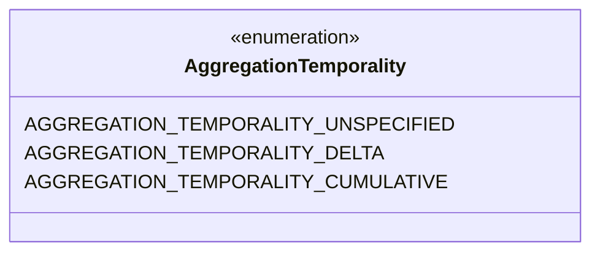
### ProfilesData Diagram

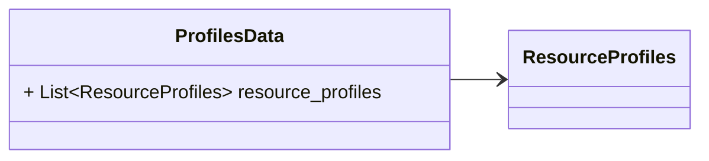
### ResourceProfiles Diagram

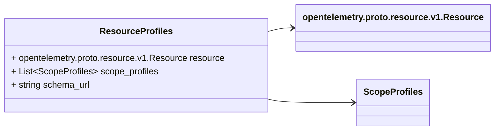
### ScopeProfiles Diagram

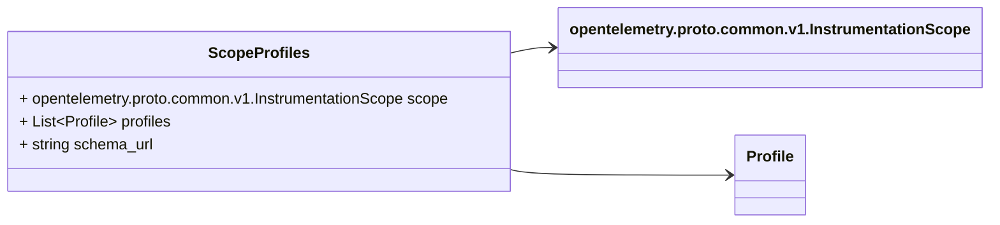
### Profile Diagram

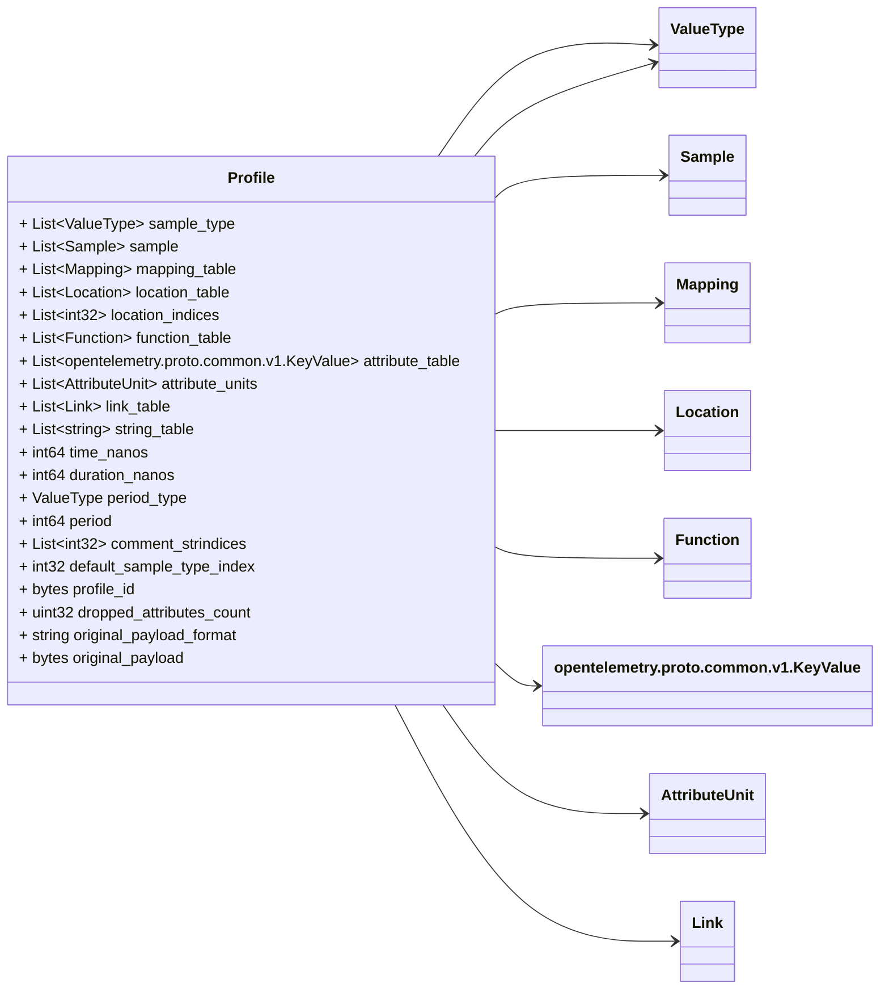
### AttributeUnit Diagram

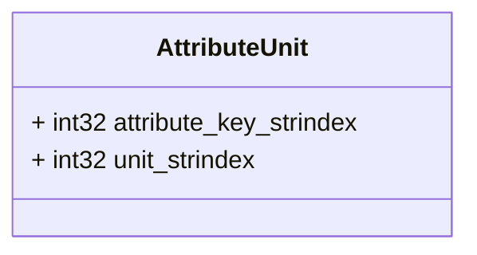
### Link Diagram

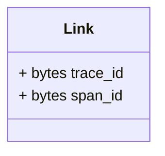
### ValueType Diagram

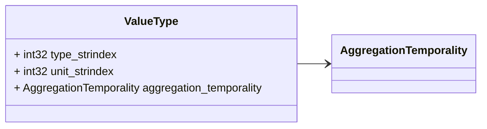
### Sample Diagram

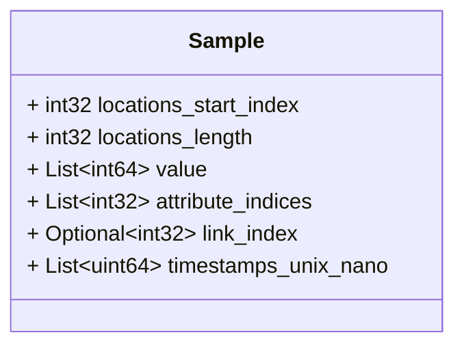
### Mapping Diagram

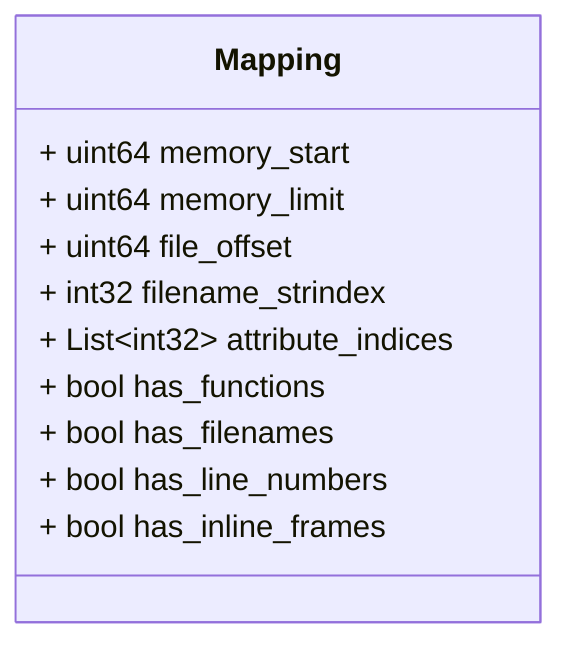
### Location Diagram

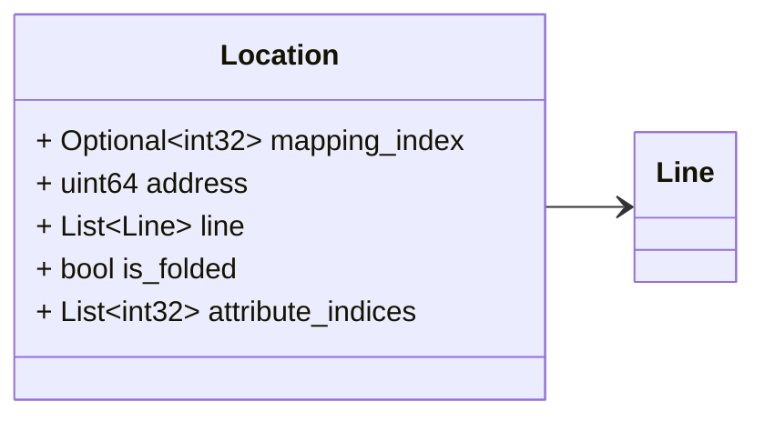
### Line Diagram

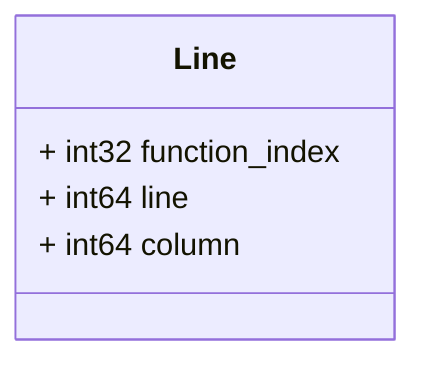
### Function Diagram

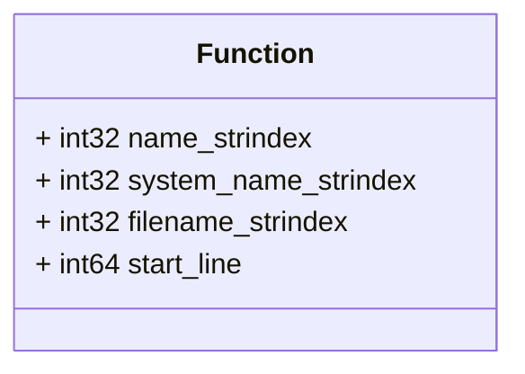

## Message: ProfilesData

FQN: opentelemetry.proto.profiles.v1development.ProfilesData

Relationships Diagram ┌──────────────────┐ LEGEND │ ProfilesData │ └──────────────────┘ ─────▶ embedded │ │ 1-n ─────▷ referenced by index ▼ ┌──────────────────┐ │ ResourceProfiles │ └──────────────────┘ │ │ 1-n ▼ ┌──────────────────┐ │ ScopeProfiles │ └──────────────────┘ │ │ 1-1 ▼ ┌──────────────────┐ │ Profile │ └──────────────────┘ │ n-1 │ 1-n ┌───────────────────────────────────────┐ ▼ │ ▽ ┌──────────────────┐ 1-n ┌──────────────┐ ┌──────────┐ │ Sample │ ──────▷ │ KeyValue │ │ Link │ └──────────────────┘ └──────────────┘ └──────────┘ │ 1-n △ △ │ 1-n ┌─────────────────┘ │ 1-n ▽ │ │ ┌──────────────────┐ n-1 ┌──────────────┐ │ Location │ ──────▷ │ Mapping │ └──────────────────┘ └──────────────┘ │ │ 1-n ▼ ┌──────────────────┐ │ Line │ └──────────────────┘ │ │ 1-1 ▽ ┌──────────────────┐ │ Function │ └──────────────────┘ ProfilesData represents the profiles data that can be stored in persistent storage, OR can be embedded by other protocols that transfer OTLP profiles data but do not implement the OTLP protocol. The main difference between this message and collector protocol is that in this message there will not be any "control" or "metadata" specific to OTLP protocol. When new fields are added into this message, the OTLP request MUST be updated as well. 

| Field             | Ordinal | Type             | Label    | Description                                                                                                                                                                                                                                                                                    |
|-------------------|---------|------------------|----------|------------------------------------------------------------------------------------------------------------------------------------------------------------------------------------------------------------------------------------------------------------------------------------------------|
| resource_profiles | 1       | ResourceProfiles | Repeated | An array of ResourceProfiles. For data coming from a single resource this array will typically contain one element. Intermediary nodes that receive data from multiple origins typically batch the data before forwarding further and in that case this array will contain multiple elements.  |

## Message: ResourceProfiles

FQN: opentelemetry.proto.profiles.v1development.ResourceProfiles

A collection of ScopeProfiles from a Resource. 

| Field          | Ordinal | Type                                     | Label    | Description                                                                                                                                                                                                                                                                                                                                                                                                                                                                                |
|----------------|---------|------------------------------------------|----------|--------------------------------------------------------------------------------------------------------------------------------------------------------------------------------------------------------------------------------------------------------------------------------------------------------------------------------------------------------------------------------------------------------------------------------------------------------------------------------------------|
| resource       | 1       | opentelemetry.proto.resource.v1.Resource |          | The resource for the profiles in this message. If this field is not set then no resource info is known.                                                                                                                                                                                                                                                                                                                                                                                    |
| scope_profiles | 2       | ScopeProfiles                            | Repeated | A list of ScopeProfiles that originate from a resource.                                                                                                                                                                                                                                                                                                                                                                                                                                    |
| schema_url     | 3       | string                                   |          | The Schema URL, if known. This is the identifier of the Schema that the resource data is recorded in. Notably, the last part of the URL path is the version number of the schema: http[s]://server[:port]/path/<version>. To learn more about Schema URL see https://opentelemetry.io/docs/specs/otel/schemas/#schema-url This schema_url applies to the data in the "resource" field. It does not apply to the data in the "scope_profiles" field which have their own schema_url field.  |

## Message: ScopeProfiles

FQN: opentelemetry.proto.profiles.v1development.ScopeProfiles

A collection of Profiles produced by an InstrumentationScope. 

| Field      | Ordinal | Type                                               | Label    | Description                                                                                                                                                                                                                                                                                                                                                                                |
|------------|---------|----------------------------------------------------|----------|--------------------------------------------------------------------------------------------------------------------------------------------------------------------------------------------------------------------------------------------------------------------------------------------------------------------------------------------------------------------------------------------|
| scope      | 1       | opentelemetry.proto.common.v1.InstrumentationScope |          | The instrumentation scope information for the profiles in this message. Semantically when InstrumentationScope isn't set, it is equivalent with an empty instrumentation scope name (unknown).                                                                                                                                                                                             |
| profiles   | 2       | Profile                                            | Repeated | A list of Profiles that originate from an instrumentation scope.                                                                                                                                                                                                                                                                                                                           |
| schema_url | 3       | string                                             |          | The Schema URL, if known. This is the identifier of the Schema that the profile data is recorded in. Notably, the last part of the URL path is the version number of the schema: http[s]://server[:port]/path/<version>. To learn more about Schema URL see https://opentelemetry.io/docs/specs/otel/schemas/#schema-url This schema_url applies to all profiles in the "profiles" field.  |

## Message: Profile

FQN: opentelemetry.proto.profiles.v1development.Profile

Profile is a common stacktrace profile format. Measurements represented with this format should follow the following conventions: - Consumers should treat unset optional fields as if they had been set with their default value. - When possible, measurements should be stored in "unsampled" form that is most useful to humans. There should be enough information present to determine the original sampled values. - On-disk, the serialized proto must be gzip-compressed. - The profile is represented as a set of samples, where each sample references a sequence of locations, and where each location belongs to a mapping. - There is a N->1 relationship from sample.location_id entries to locations. For every sample.location_id entry there must be a unique Location with that index. - There is an optional N->1 relationship from locations to mappings. For every nonzero Location.mapping_id there must be a unique Mapping with that index. Represents a complete profile, including sample types, samples, mappings to binaries, locations, functions, string table, and additional metadata. It modifies and annotates pprof Profile with OpenTelemetry specific fields. Note that whilst fields in this message retain the name and field id from pprof in most cases for ease of understanding data migration, it is not intended that pprof:Profile and OpenTelemetry:Profile encoding be wire compatible. 

| Field                     | Ordinal | Type                                   | Label    | Description                                                                                                                                                                                                                                                                                                                                                                                                                                                                                                                                                                                                         |
|---------------------------|---------|----------------------------------------|----------|---------------------------------------------------------------------------------------------------------------------------------------------------------------------------------------------------------------------------------------------------------------------------------------------------------------------------------------------------------------------------------------------------------------------------------------------------------------------------------------------------------------------------------------------------------------------------------------------------------------------|
| sample_type               | 1       | ValueType                              | Repeated | A description of the samples associated with each Sample.value. For a cpu profile this might be: [["cpu","nanoseconds"]] or [["wall","seconds"]] or [["syscall","count"]] For a heap profile, this might be: [["allocations","count"], ["space","bytes"]], If one of the values represents the number of events represented by the sample, by convention it should be at index 0 and use sample_type.unit == "count".                                                                                                                                                                                               |
| sample                    | 2       | Sample                                 | Repeated | The set of samples recorded in this profile.                                                                                                                                                                                                                                                                                                                                                                                                                                                                                                                                                                        |
| mapping_table             | 3       | Mapping                                | Repeated | Mapping from address ranges to the image/binary/library mapped into that address range. mapping[0] will be the main binary. If multiple binaries contribute to the Profile and no main binary can be identified, mapping[0] has no special meaning.                                                                                                                                                                                                                                                                                                                                                                 |
| location_table            | 4       | Location                               | Repeated | Locations referenced by samples via location_indices.                                                                                                                                                                                                                                                                                                                                                                                                                                                                                                                                                               |
| location_indices          | 5       | int32                                  | Repeated | Array of locations referenced by samples.                                                                                                                                                                                                                                                                                                                                                                                                                                                                                                                                                                           |
| function_table            | 6       | Function                               | Repeated | Functions referenced by locations.                                                                                                                                                                                                                                                                                                                                                                                                                                                                                                                                                                                  |
| attribute_table           | 7       | opentelemetry.proto.common.v1.KeyValue | Repeated | Lookup table for attributes.                                                                                                                                                                                                                                                                                                                                                                                                                                                                                                                                                                                        |
| attribute_units           | 8       | AttributeUnit                          | Repeated | Represents a mapping between Attribute Keys and Units.                                                                                                                                                                                                                                                                                                                                                                                                                                                                                                                                                              |
| link_table                | 9       | Link                                   | Repeated | Lookup table for links.                                                                                                                                                                                                                                                                                                                                                                                                                                                                                                                                                                                             |
| string_table              | 10      | string                                 | Repeated | A common table for strings referenced by various messages. string_table[0] must always be "".                                                                                                                                                                                                                                                                                                                                                                                                                                                                                                                       |
| time_nanos                | 11      | int64                                  |          | The following fields 9-14 are informational, do not affect interpretation of results. Time of collection (UTC) represented as nanoseconds past the epoch.                                                                                                                                                                                                                                                                                                                                                                                                                                                           |
| duration_nanos            | 12      | int64                                  |          | Duration of the profile, if a duration makes sense.                                                                                                                                                                                                                                                                                                                                                                                                                                                                                                                                                                 |
| period_type               | 13      | ValueType                              |          | The kind of events between sampled occurrences. e.g [ "cpu","cycles" ] or [ "heap","bytes" ]                                                                                                                                                                                                                                                                                                                                                                                                                                                                                                                        |
| period                    | 14      | int64                                  |          | The number of events between sampled occurrences.                                                                                                                                                                                                                                                                                                                                                                                                                                                                                                                                                                   |
| comment_strindices        | 15      | int32                                  | Repeated | Free-form text associated with the profile. The text is displayed as is to the user by the tools that read profiles (e.g. by pprof). This field should not be used to store any machine-readable information, it is only for human-friendly content. The profile must stay functional if this field is cleaned. Indices into string table.                                                                                                                                                                                                                                                                          |
| default_sample_type_index | 16      | int32                                  |          | Index into the sample_type array to the default sample type.                                                                                                                                                                                                                                                                                                                                                                                                                                                                                                                                                        |
| profile_id                | 17      | bytes                                  |          | A globally unique identifier for a profile. The ID is a 16-byte array. An ID with all zeroes is considered invalid. This field is required.                                                                                                                                                                                                                                                                                                                                                                                                                                                                         |
| dropped_attributes_count  | 19      | uint32                                 |          | dropped_attributes_count is the number of attributes that were discarded. Attributes can be discarded because their keys are too long or because there are too many attributes. If this value is 0, then no attributes were dropped.                                                                                                                                                                                                                                                                                                                                                                                |
| original_payload_format   | 20      | string                                 |          | Specifies format of the original payload. Common values are defined in semantic conventions. [required if original_payload is present]                                                                                                                                                                                                                                                                                                                                                                                                                                                                              |
| original_payload          | 21      | bytes                                  |          | Original payload can be stored in this field. This can be useful for users who want to get the original payload. Formats such as JFR are highly extensible and can contain more information than what is defined in this spec. Inclusion of original payload should be configurable by the user. Default behavior should be to not include the original payload. If the original payload is in pprof format, it SHOULD not be included in this field. The field is optional, however if it is present then equivalent converted data should be populated in other fields of this message as far as is practicable.  |

## Message: AttributeUnit

FQN: opentelemetry.proto.profiles.v1development.AttributeUnit

Represents a mapping between Attribute Keys and Units. 

| Field                  | Ordinal | Type  | Label | Description               |
|------------------------|---------|-------|-------|---------------------------|
| attribute_key_strindex | 1       | int32 |       | Index into string table.  |
| unit_strindex          | 2       | int32 |       | Index into string table.  |

## Message: Link

FQN: opentelemetry.proto.profiles.v1development.Link

A pointer from a profile Sample to a trace Span. Connects a profile sample to a trace span, identified by unique trace and span IDs. 

| Field    | Ordinal | Type  | Label | Description                                                                                  |
|----------|---------|-------|-------|----------------------------------------------------------------------------------------------|
| trace_id | 1       | bytes |       | A unique identifier of a trace that this linked span is part of. The ID is a 16-byte array.  |
| span_id  | 2       | bytes |       | A unique identifier for the linked span. The ID is an 8-byte array.                          |

## Message: ValueType

FQN: opentelemetry.proto.profiles.v1development.ValueType

ValueType describes the type and units of a value, with an optional aggregation temporality. 

| Field                   | Ordinal | Type                   | Label | Description               |
|-------------------------|---------|------------------------|-------|---------------------------|
| type_strindex           | 1       | int32                  |       | Index into string table.  |
| unit_strindex           | 2       | int32                  |       | Index into string table.  |
| aggregation_temporality | 3       | AggregationTemporality |       |                           |

## Message: Sample

FQN: opentelemetry.proto.profiles.v1development.Sample

Each Sample records values encountered in some program context. The program context is typically a stack trace, perhaps augmented with auxiliary information like the thread-id, some indicator of a higher level request being handled etc. 

| Field                 | Ordinal | Type   | Label    | Description                                                                                                                                                                                                                                                                                                                                        |
|-----------------------|---------|--------|----------|----------------------------------------------------------------------------------------------------------------------------------------------------------------------------------------------------------------------------------------------------------------------------------------------------------------------------------------------------|
| locations_start_index | 1       | int32  |          | locations_start_index along with locations_length refers to to a slice of locations in Profile.location_indices.                                                                                                                                                                                                                                   |
| locations_length      | 2       | int32  |          | locations_length along with locations_start_index refers to a slice of locations in Profile.location_indices. Supersedes location_index.                                                                                                                                                                                                           |
| value                 | 3       | int64  | Repeated | The type and unit of each value is defined by the corresponding entry in Profile.sample_type. All samples must have the same number of values, the same as the length of Profile.sample_type. When aggregating multiple samples into a single sample, the result has a list of values that is the element-wise sum of the lists of the originals.  |
| attribute_indices     | 4       | int32  | Repeated | References to attributes in Profile.attribute_table. [optional]                                                                                                                                                                                                                                                                                    |
| link_index            | 5       | int32  | Optional | Reference to link in Profile.link_table. [optional]                                                                                                                                                                                                                                                                                                |
| timestamps_unix_nano  | 6       | uint64 | Repeated | Timestamps associated with Sample represented in nanoseconds. These timestamps are expected to fall within the Profile's time range. [optional]                                                                                                                                                                                                    |

## Message: Mapping

FQN: opentelemetry.proto.profiles.v1development.Mapping

Describes the mapping of a binary in memory, including its address range, file offset, and metadata like build ID 

| Field             | Ordinal | Type   | Label    | Description                                                                                                                                                                    |
|-------------------|---------|--------|----------|--------------------------------------------------------------------------------------------------------------------------------------------------------------------------------|
| memory_start      | 1       | uint64 |          | Address at which the binary (or DLL) is loaded into memory.                                                                                                                    |
| memory_limit      | 2       | uint64 |          | The limit of the address range occupied by this mapping.                                                                                                                       |
| file_offset       | 3       | uint64 |          | Offset in the binary that corresponds to the first mapped address.                                                                                                             |
| filename_strindex | 4       | int32  |          | The object this entry is loaded from. This can be a filename on disk for the main binary and shared libraries, or virtual abstractions like "[vdso]". Index into string table  |
| attribute_indices | 5       | int32  | Repeated | References to attributes in Profile.attribute_table. [optional]                                                                                                                |
| has_functions     | 6       | bool   |          | The following fields indicate the resolution of symbolic info.                                                                                                                 |
| has_filenames     | 7       | bool   |          |                                                                                                                                                                                |
| has_line_numbers  | 8       | bool   |          |                                                                                                                                                                                |
| has_inline_frames | 9       | bool   |          |                                                                                                                                                                                |

## Message: Location

FQN: opentelemetry.proto.profiles.v1development.Location

Describes function and line table debug information. 

| Field             | Ordinal | Type   | Label    | Description                                                                                                                                                                                                                                                                                                |
|-------------------|---------|--------|----------|------------------------------------------------------------------------------------------------------------------------------------------------------------------------------------------------------------------------------------------------------------------------------------------------------------|
| mapping_index     | 1       | int32  | Optional | Reference to mapping in Profile.mapping_table. It can be unset if the mapping is unknown or not applicable for this profile type.                                                                                                                                                                          |
| address           | 2       | uint64 |          | The instruction address for this location, if available. It should be within [Mapping.memory_start...Mapping.memory_limit] for the corresponding mapping. A non-leaf address may be in the middle of a call instruction. It is up to display tools to find the beginning of the instruction if necessary.  |
| line              | 3       | Line   | Repeated | Multiple line indicates this location has inlined functions, where the last entry represents the caller into which the preceding entries were inlined. E.g., if memcpy() is inlined into printf: line[0].function_name == "memcpy" line[1].function_name == "printf"                                       |
| is_folded         | 4       | bool   |          | Provides an indication that multiple symbols map to this location's address, for example due to identical code folding by the linker. In that case the line information above represents one of the multiple symbols. This field must be recomputed when the symbolization state of the profile changes.   |
| attribute_indices | 5       | int32  | Repeated | References to attributes in Profile.attribute_table. [optional]                                                                                                                                                                                                                                            |

## Message: Line

FQN: opentelemetry.proto.profiles.v1development.Line

Details a specific line in a source code, linked to a function. 

| Field          | Ordinal | Type  | Label | Description                                       |
|----------------|---------|-------|-------|---------------------------------------------------|
| function_index | 1       | int32 |       | Reference to function in Profile.function_table.  |
| line           | 2       | int64 |       | Line number in source code.                       |
| column         | 3       | int64 |       | Column number in source code.                     |

## Message: Function

FQN: opentelemetry.proto.profiles.v1development.Function

Describes a function, including its human-readable name, system name, source file, and starting line number in the source. 

| Field                | Ordinal | Type  | Label | Description                                                                                                             |
|----------------------|---------|-------|-------|-------------------------------------------------------------------------------------------------------------------------|
| name_strindex        | 1       | int32 |       | Name of the function, in human-readable form if available. Index into string table                                      |
| system_name_strindex | 2       | int32 |       | Name of the function, as identified by the system. For instance, it can be a C++ mangled name. Index into string table  |
| filename_strindex    | 3       | int32 |       | Source file containing the function. Index into string table                                                            |
| start_line           | 4       | int64 |       | Line number in source file.                                                                                             |

<!-- Created by: Proto Diagram Tool -->
<!-- https://github.com/GoogleCloudPlatform/proto-gen-md-diagrams -->
