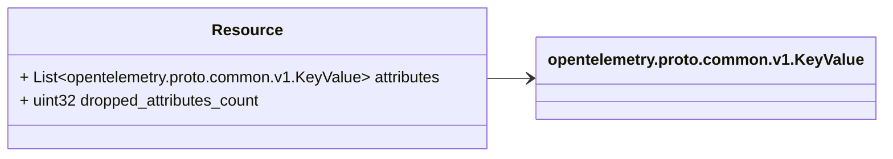

# Package: opentelemetry.proto.resource.v1

Copyright 2019, OpenTelemetry Authors Licensed under the Apache License, Version 2.0 (the "License"); you may not use this file except in compliance with the License. You may obtain a copy of the License at http://www.apache.org/licenses/LICENSE-2.0 Unless required by applicable law or agreed to in writing, software distributed under the License is distributed on an "AS IS" BASIS, WITHOUT WARRANTIES OR CONDITIONS OF ANY KIND, either express or implied. See the License for the specific language governing permissions and limitations under the License. 

## Imports

| Import                                     | Description |
|--------------------------------------------|-------------|
| opentelemetry/proto/common/v1/common.proto |             |

## Options

| Name                 | Value                                      | Description |
|----------------------|--------------------------------------------|-------------|
| csharp_namespace     | OpenTelemetry.Proto.Resource.V1            |             |
| java_multiple_files  | true                                       |             |
| java_package         | io.opentelemetry.proto.resource.v1         |             |
| java_outer_classname | ResourceProto                              |             |
| go_package           | go.opentelemetry.io/proto/otlp/resource/v1 |             |

### Resource Diagram

## Message: Resource

FQN: opentelemetry.proto.resource.v1.Resource

Resource information. 

| Field                    | Ordinal | Type                                   | Label    | Description                                                                                                                                         |
|--------------------------|---------|----------------------------------------|----------|-----------------------------------------------------------------------------------------------------------------------------------------------------|
| attributes               | 1       | opentelemetry.proto.common.v1.KeyValue | Repeated | Set of attributes that describe the resource. Attribute keys MUST be unique (it is not allowed to have more than one attribute with the same key).  |
| dropped_attributes_count | 2       | uint32                                 |          | dropped_attributes_count is the number of dropped attributes. If the value is 0, then no attributes were dropped.                                   |

<!-- Created by: Proto Diagram Tool -->
<!-- https://github.com/GoogleCloudPlatform/proto-gen-md-diagrams -->
