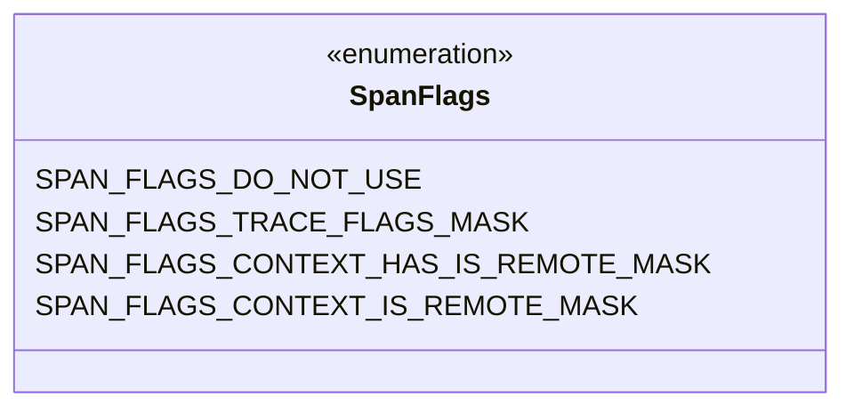
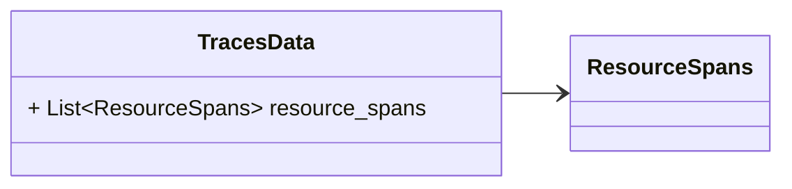
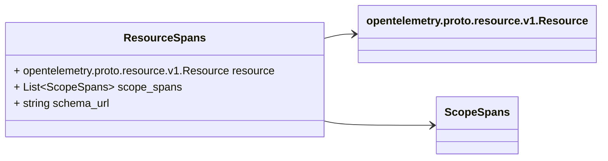
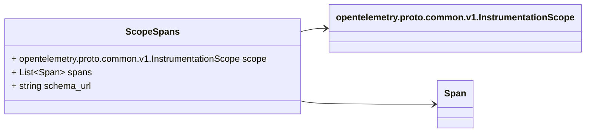
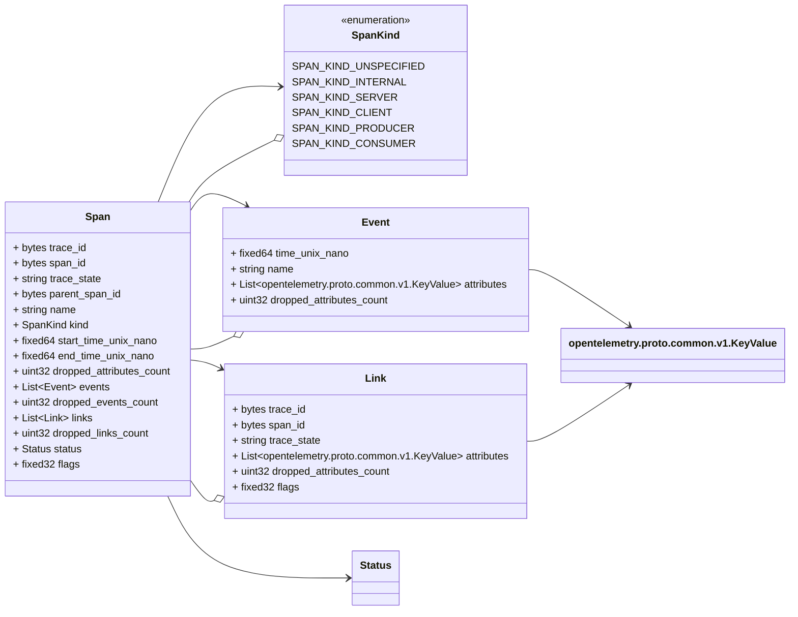
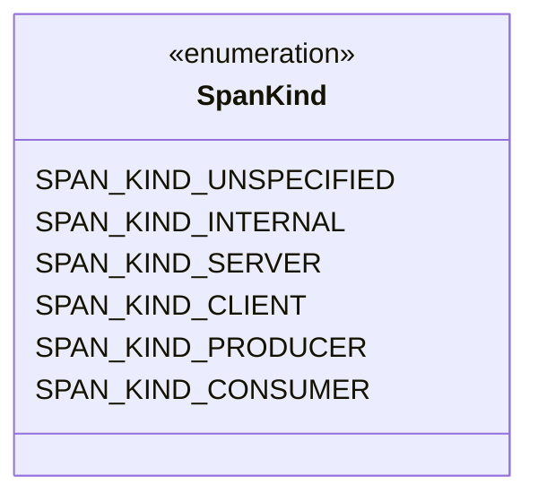
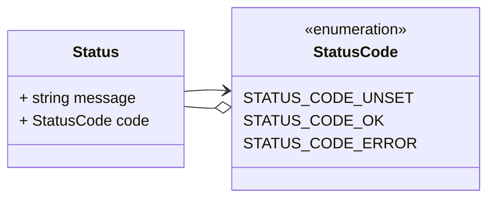
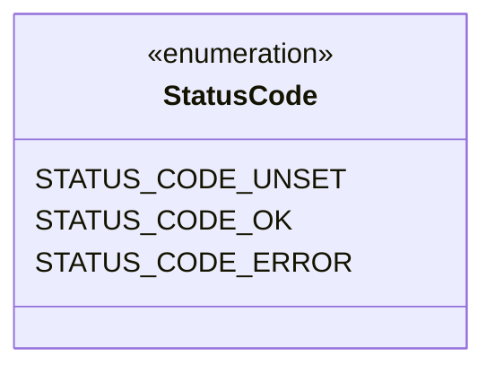
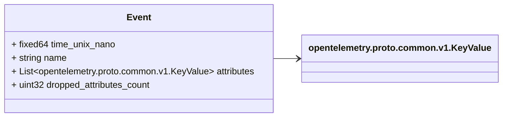
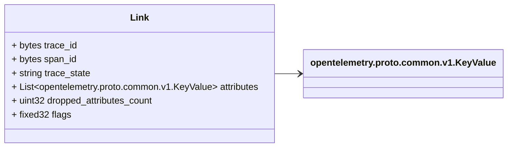

# Package: opentelemetry.proto.trace.v1

Copyright 2019, OpenTelemetry Authors Licensed under the Apache License, Version 2.0 (the "License"); you may not use this file except in compliance with the License. You may obtain a copy of the License at http://www.apache.org/licenses/LICENSE-2.0 Unless required by applicable law or agreed to in writing, software distributed under the License is distributed on an "AS IS" BASIS, WITHOUT WARRANTIES OR CONDITIONS OF ANY KIND, either express or implied. See the License for the specific language governing permissions and limitations under the License. 

## Imports

| Import                                         | Description |
|------------------------------------------------|-------------|
| opentelemetry/proto/common/v1/common.proto     |             |
| opentelemetry/proto/resource/v1/resource.proto |             |

## Options

| Name                 | Value                                   | Description |
|----------------------|-----------------------------------------|-------------|
| csharp_namespace     | OpenTelemetry.Proto.Trace.V1            |             |
| java_multiple_files  | true                                    |             |
| java_package         | io.opentelemetry.proto.trace.v1         |             |
| java_outer_classname | TraceProto                              |             |
| go_package           | go.opentelemetry.io/proto/otlp/trace/v1 |             |

## Enum: SpanFlags

FQN: opentelemetry.proto.trace.v1.SpanFlags

SpanFlags represents constants used to interpret the Span.flags field, which is protobuf 'fixed32' type and is to be used as bit-fields. Each non-zero value defined in this enum is a bit-mask. To extract the bit-field, for example, use an expression like: (span.flags & SPAN_FLAGS_TRACE_FLAGS_MASK) See https://www.w3.org/TR/trace-context-2/#trace-flags for the flag definitions. Note that Span flags were introduced in version 1.1 of the OpenTelemetry protocol. Older Span producers do not set this field, consequently consumers should not rely on the absence of a particular flag bit to indicate the presence of a particular feature. 

| Name                                  | Ordinal | Description                                                                                                                                                                                                     |
|---------------------------------------|---------|-----------------------------------------------------------------------------------------------------------------------------------------------------------------------------------------------------------------|
| SPAN_FLAGS_DO_NOT_USE                 | 0       | The zero value for the enum. Should not be used for comparisons. Instead use bitwise "and" with the appropriate mask as shown above.                                                                            |
| SPAN_FLAGS_TRACE_FLAGS_MASK           | 0       | Bits 0-7 are used for trace flags.                                                                                                                                                                              |
| SPAN_FLAGS_CONTEXT_HAS_IS_REMOTE_MASK | 0       | Bits 8 and 9 are used to indicate that the parent span or link span is remote. Bit 8 (`HAS_IS_REMOTE`) indicates whether the value is known. Bit 9 (`IS_REMOTE`) indicates whether the span or link is remote.  |
| SPAN_FLAGS_CONTEXT_IS_REMOTE_MASK     | 0       |                                                                                                                                                                                                                 |

### SpanFlags Diagram

### TracesData Diagram

### ResourceSpans Diagram

### ScopeSpans Diagram

### Span Diagram

### SpanKind Diagram

### Status Diagram

### StatusCode Diagram

## Message: TracesData

FQN: opentelemetry.proto.trace.v1.TracesData

TracesData represents the traces data that can be stored in a persistent storage, OR can be embedded by other protocols that transfer OTLP traces data but do not implement the OTLP protocol. The main difference between this message and collector protocol is that in this message there will not be any "control" or "metadata" specific to OTLP protocol. When new fields are added into this message, the OTLP request MUST be updated as well. 

| Field          | Ordinal | Type          | Label    | Description                                                                                                                                                                                                                                                                                 |
|----------------|---------|---------------|----------|---------------------------------------------------------------------------------------------------------------------------------------------------------------------------------------------------------------------------------------------------------------------------------------------|
| resource_spans | 1       | ResourceSpans | Repeated | An array of ResourceSpans. For data coming from a single resource this array will typically contain one element. Intermediary nodes that receive data from multiple origins typically batch the data before forwarding further and in that case this array will contain multiple elements.  |

## Message: ResourceSpans

FQN: opentelemetry.proto.trace.v1.ResourceSpans

A collection of ScopeSpans from a Resource. 

| Field       | Ordinal | Type                                     | Label    | Description                                                                                                                                                                                                                                                                                                                                                                                                                                                                             |
|-------------|---------|------------------------------------------|----------|-----------------------------------------------------------------------------------------------------------------------------------------------------------------------------------------------------------------------------------------------------------------------------------------------------------------------------------------------------------------------------------------------------------------------------------------------------------------------------------------|
| resource    | 1       | opentelemetry.proto.resource.v1.Resource |          | The resource for the spans in this message. If this field is not set then no resource info is known.                                                                                                                                                                                                                                                                                                                                                                                    |
| scope_spans | 2       | ScopeSpans                               | Repeated | A list of ScopeSpans that originate from a resource.                                                                                                                                                                                                                                                                                                                                                                                                                                    |
| schema_url  | 3       | string                                   |          | The Schema URL, if known. This is the identifier of the Schema that the resource data is recorded in. Notably, the last part of the URL path is the version number of the schema: http[s]://server[:port]/path/<version>. To learn more about Schema URL see https://opentelemetry.io/docs/specs/otel/schemas/#schema-url This schema_url applies to the data in the "resource" field. It does not apply to the data in the "scope_spans" field which have their own schema_url field.  |

## Message: ScopeSpans

FQN: opentelemetry.proto.trace.v1.ScopeSpans

A collection of Spans produced by an InstrumentationScope. 

| Field      | Ordinal | Type                                               | Label    | Description                                                                                                                                                                                                                                                                                                                                                                                       |
|------------|---------|----------------------------------------------------|----------|---------------------------------------------------------------------------------------------------------------------------------------------------------------------------------------------------------------------------------------------------------------------------------------------------------------------------------------------------------------------------------------------------|
| scope      | 1       | opentelemetry.proto.common.v1.InstrumentationScope |          | The instrumentation scope information for the spans in this message. Semantically when InstrumentationScope isn't set, it is equivalent with an empty instrumentation scope name (unknown).                                                                                                                                                                                                       |
| spans      | 2       | Span                                               | Repeated | A list of Spans that originate from an instrumentation scope.                                                                                                                                                                                                                                                                                                                                     |
| schema_url | 3       | string                                             |          | The Schema URL, if known. This is the identifier of the Schema that the span data is recorded in. Notably, the last part of the URL path is the version number of the schema: http[s]://server[:port]/path/<version>. To learn more about Schema URL see https://opentelemetry.io/docs/specs/otel/schemas/#schema-url This schema_url applies to all spans and span events in the "spans" field.  |

## Message: Span

FQN: opentelemetry.proto.trace.v1.Span

A Span represents a single operation performed by a single component of the system. The next available field id is 17. 

| Field                    | Ordinal | Type     | Label    | Description                                                                                                                                                                                                                                                                                                                                                                                                                                                                                                                                                                                                                                                                                                                                                                                                                                                                                                                                                                                                                                                                                    |
|--------------------------|---------|----------|----------|------------------------------------------------------------------------------------------------------------------------------------------------------------------------------------------------------------------------------------------------------------------------------------------------------------------------------------------------------------------------------------------------------------------------------------------------------------------------------------------------------------------------------------------------------------------------------------------------------------------------------------------------------------------------------------------------------------------------------------------------------------------------------------------------------------------------------------------------------------------------------------------------------------------------------------------------------------------------------------------------------------------------------------------------------------------------------------------------|
| trace_id                 | 1       | bytes    |          | A unique identifier for a trace. All spans from the same trace share the same `trace_id`. The ID is a 16-byte array. An ID with all zeroes OR of length other than 16 bytes is considered invalid (empty string in OTLP/JSON is zero-length and thus is also invalid). This field is required.                                                                                                                                                                                                                                                                                                                                                                                                                                                                                                                                                                                                                                                                                                                                                                                                 |
| span_id                  | 2       | bytes    |          | A unique identifier for a span within a trace, assigned when the span is created. The ID is an 8-byte array. An ID with all zeroes OR of length other than 8 bytes is considered invalid (empty string in OTLP/JSON is zero-length and thus is also invalid). This field is required.                                                                                                                                                                                                                                                                                                                                                                                                                                                                                                                                                                                                                                                                                                                                                                                                          |
| trace_state              | 3       | string   |          | trace_state conveys information about request position in multiple distributed tracing graphs. It is a trace_state in w3c-trace-context format: https://www.w3.org/TR/trace-context/#tracestate-header See also https://github.com/w3c/distributed-tracing for more details about this field.                                                                                                                                                                                                                                                                                                                                                                                                                                                                                                                                                                                                                                                                                                                                                                                                  |
| parent_span_id           | 4       | bytes    |          | The `span_id` of this span's parent span. If this is a root span, then this field must be empty. The ID is an 8-byte array.                                                                                                                                                                                                                                                                                                                                                                                                                                                                                                                                                                                                                                                                                                                                                                                                                                                                                                                                                                    |
| name                     | 5       | string   |          | A description of the span's operation. For example, the name can be a qualified method name or a file name and a line number where the operation is called. A best practice is to use the same display name at the same call point in an application. This makes it easier to correlate spans in different traces. This field is semantically required to be set to non-empty string. Empty value is equivalent to an unknown span name. This field is required.                                                                                                                                                                                                                                                                                                                                                                                                                                                                                                                                                                                                                               |
| kind                     | 6       | SpanKind |          | Distinguishes between spans generated in a particular context. For example, two spans with the same name may be distinguished using `CLIENT` (caller) and `SERVER` (callee) to identify queueing latency associated with the span.                                                                                                                                                                                                                                                                                                                                                                                                                                                                                                                                                                                                                                                                                                                                                                                                                                                             |
| start_time_unix_nano     | 7       | fixed64  |          | start_time_unix_nano is the start time of the span. On the client side, this is the time kept by the local machine where the span execution starts. On the server side, this is the time when the server's application handler starts running. Value is UNIX Epoch time in nanoseconds since 00:00:00 UTC on 1 January 1970. This field is semantically required and it is expected that end_time >= start_time.                                                                                                                                                                                                                                                                                                                                                                                                                                                                                                                                                                                                                                                                               |
| end_time_unix_nano       | 8       | fixed64  |          | end_time_unix_nano is the end time of the span. On the client side, this is the time kept by the local machine where the span execution ends. On the server side, this is the time when the server application handler stops running. Value is UNIX Epoch time in nanoseconds since 00:00:00 UTC on 1 January 1970. This field is semantically required and it is expected that end_time >= start_time.                                                                                                                                                                                                                                                                                                                                                                                                                                                                                                                                                                                                                                                                                        |
| dropped_attributes_count | 10      | uint32   |          | attributes is a collection of key/value pairs. Note, global attributes like server name can be set using the resource API. Examples of attributes: "/http/user_agent": "Mozilla/5.0 (Macintosh; dropped_attributes_count is the number of attributes that were discarded. Attributes can be discarded because their keys are too long or because there are too many attributes. If this value is 0, then no attributes were dropped.                                                                                                                                                                                                                                                                                                                                                                                                                                                                                                                                                                                                                                                           |
| events                   | 11      | Event    | Repeated | events is a collection of Event items.                                                                                                                                                                                                                                                                                                                                                                                                                                                                                                                                                                                                                                                                                                                                                                                                                                                                                                                                                                                                                                                         |
| dropped_events_count     | 12      | uint32   |          | dropped_events_count is the number of dropped events. If the value is 0, then no events were dropped.                                                                                                                                                                                                                                                                                                                                                                                                                                                                                                                                                                                                                                                                                                                                                                                                                                                                                                                                                                                          |
| links                    | 13      | Link     | Repeated | links is a collection of Links, which are references from this span to a span in the same or different trace.                                                                                                                                                                                                                                                                                                                                                                                                                                                                                                                                                                                                                                                                                                                                                                                                                                                                                                                                                                                  |
| dropped_links_count      | 14      | uint32   |          | dropped_links_count is the number of dropped links after the maximum size was enforced. If this value is 0, then no links were dropped.                                                                                                                                                                                                                                                                                                                                                                                                                                                                                                                                                                                                                                                                                                                                                                                                                                                                                                                                                        |
| status                   | 15      | Status   |          | An optional final status for this span. Semantically when Status isn't set, it means span's status code is unset, i.e. assume STATUS_CODE_UNSET (code = 0).                                                                                                                                                                                                                                                                                                                                                                                                                                                                                                                                                                                                                                                                                                                                                                                                                                                                                                                                    |
| flags                    | 16      | fixed32  |          | Flags, a bit field. Bits 0-7 (8 least significant bits) are the trace flags as defined in W3C Trace Context specification. To read the 8-bit W3C trace flag, use `flags & SPAN_FLAGS_TRACE_FLAGS_MASK`. See https://www.w3.org/TR/trace-context-2/#trace-flags for the flag definitions. Bits 8 and 9 represent the 3 states of whether a span's parent is remote. The states are (unknown, is not remote, is remote). To read whether the value is known, use `(flags & SPAN_FLAGS_CONTEXT_HAS_IS_REMOTE_MASK) != 0`. To read whether the span is remote, use `(flags & SPAN_FLAGS_CONTEXT_IS_REMOTE_MASK) != 0`. When creating span messages, if the message is logically forwarded from another source with an equivalent flags fields (i.e., usually another OTLP span message), the field SHOULD be copied as-is. If creating from a source that does not have an equivalent flags field (such as a runtime representation of an OpenTelemetry span), the high 22 bits MUST be set to zero. Readers MUST NOT assume that bits 10-31 (22 most significant bits) will be zero. [Optional].  |

## Enum: SpanKind

FQN: opentelemetry.proto.trace.v1.Span.SpanKind

SpanKind is the type of span. Can be used to specify additional relationships between spans in addition to a parent/child relationship. 

| Name                  | Ordinal | Description                                                                                                                                                                                                                                                                                                                                         |
|-----------------------|---------|-----------------------------------------------------------------------------------------------------------------------------------------------------------------------------------------------------------------------------------------------------------------------------------------------------------------------------------------------------|
| SPAN_KIND_UNSPECIFIED | 0       | Unspecified. Do NOT use as default. Implementations MAY assume SpanKind to be INTERNAL when receiving UNSPECIFIED.                                                                                                                                                                                                                                  |
| SPAN_KIND_INTERNAL    | 1       | Indicates that the span represents an internal operation within an application, as opposed to an operation happening at the boundaries. Default value.                                                                                                                                                                                              |
| SPAN_KIND_SERVER      | 2       | Indicates that the span covers server-side handling of an RPC or other remote network request.                                                                                                                                                                                                                                                      |
| SPAN_KIND_CLIENT      | 3       | Indicates that the span describes a request to some remote service.                                                                                                                                                                                                                                                                                 |
| SPAN_KIND_PRODUCER    | 4       | Indicates that the span describes a producer sending a message to a broker. Unlike CLIENT and SERVER, there is often no direct critical path latency relationship between producer and consumer spans. A PRODUCER span ends when the message was accepted by the broker while the logical processing of the message might span a much longer time.  |
| SPAN_KIND_CONSUMER    | 5       | Indicates that the span describes consumer receiving a message from a broker. Like the PRODUCER kind, there is often no direct critical path latency relationship between producer and consumer spans.                                                                                                                                              |

### Event Diagram

### Link Diagram

## Message: Event

FQN: opentelemetry.proto.trace.v1.Span.Event

Event is a time-stamped annotation of the span, consisting of user-supplied text description and key-value pairs. 

| Field                    | Ordinal | Type                                   | Label    | Description                                                                                                                                                                 |
|--------------------------|---------|----------------------------------------|----------|-----------------------------------------------------------------------------------------------------------------------------------------------------------------------------|
| time_unix_nano           | 1       | fixed64                                |          | time_unix_nano is the time the event occurred.                                                                                                                              |
| name                     | 2       | string                                 |          | name of the event. This field is semantically required to be set to non-empty string.                                                                                       |
| attributes               | 3       | opentelemetry.proto.common.v1.KeyValue | Repeated | attributes is a collection of attribute key/value pairs on the event. Attribute keys MUST be unique (it is not allowed to have more than one attribute with the same key).  |
| dropped_attributes_count | 4       | uint32                                 |          | dropped_attributes_count is the number of dropped attributes. If the value is 0, then no attributes were dropped.                                                           |

## Message: Link

FQN: opentelemetry.proto.trace.v1.Span.Link

A pointer from the current span to another span in the same trace or in a different trace. For example, this can be used in batching operations, where a single batch handler processes multiple requests from different traces or when the handler receives a request from a different project. 

| Field                    | Ordinal | Type                                   | Label    | Description                                                                                                                                                                                                                                                                                                                                                                                                                                                                                                                                                                                                                                                                                                                                                                            |
|--------------------------|---------|----------------------------------------|----------|----------------------------------------------------------------------------------------------------------------------------------------------------------------------------------------------------------------------------------------------------------------------------------------------------------------------------------------------------------------------------------------------------------------------------------------------------------------------------------------------------------------------------------------------------------------------------------------------------------------------------------------------------------------------------------------------------------------------------------------------------------------------------------------|
| trace_id                 | 1       | bytes                                  |          | A unique identifier of a trace that this linked span is part of. The ID is a 16-byte array.                                                                                                                                                                                                                                                                                                                                                                                                                                                                                                                                                                                                                                                                                            |
| span_id                  | 2       | bytes                                  |          | A unique identifier for the linked span. The ID is an 8-byte array.                                                                                                                                                                                                                                                                                                                                                                                                                                                                                                                                                                                                                                                                                                                    |
| trace_state              | 3       | string                                 |          | The trace_state associated with the link.                                                                                                                                                                                                                                                                                                                                                                                                                                                                                                                                                                                                                                                                                                                                              |
| attributes               | 4       | opentelemetry.proto.common.v1.KeyValue | Repeated | attributes is a collection of attribute key/value pairs on the link. Attribute keys MUST be unique (it is not allowed to have more than one attribute with the same key).                                                                                                                                                                                                                                                                                                                                                                                                                                                                                                                                                                                                              |
| dropped_attributes_count | 5       | uint32                                 |          | dropped_attributes_count is the number of dropped attributes. If the value is 0, then no attributes were dropped.                                                                                                                                                                                                                                                                                                                                                                                                                                                                                                                                                                                                                                                                      |
| flags                    | 6       | fixed32                                |          | Flags, a bit field. Bits 0-7 (8 least significant bits) are the trace flags as defined in W3C Trace Context specification. To read the 8-bit W3C trace flag, use `flags & SPAN_FLAGS_TRACE_FLAGS_MASK`. See https://www.w3.org/TR/trace-context-2/#trace-flags for the flag definitions. Bits 8 and 9 represent the 3 states of whether the link is remote. The states are (unknown, is not remote, is remote). To read whether the value is known, use `(flags & SPAN_FLAGS_CONTEXT_HAS_IS_REMOTE_MASK) != 0`. To read whether the link is remote, use `(flags & SPAN_FLAGS_CONTEXT_IS_REMOTE_MASK) != 0`. Readers MUST NOT assume that bits 10-31 (22 most significant bits) will be zero. When creating new spans, bits 10-31 (most-significant 22-bits) MUST be zero. [Optional].  |

## Message: Status

FQN: opentelemetry.proto.trace.v1.Status

The Status type defines a logical error model that is suitable for different programming environments, including REST APIs and RPC APIs. 

| Field   | Ordinal | Type       | Label | Description                                       |
|---------|---------|------------|-------|---------------------------------------------------|
| message | 2       | string     |       | A developer-facing human readable error message.  |
| code    | 3       | StatusCode |       | The status code.                                  |

## Enum: StatusCode

FQN: opentelemetry.proto.trace.v1.Status.StatusCode

For the semantics of status codes see https://github.com/open-telemetry/opentelemetry-specification/blob/main/specification/trace/api.md#set-status 

| Name              | Ordinal | Description                                                                                          |
|-------------------|---------|------------------------------------------------------------------------------------------------------|
| STATUS_CODE_UNSET | 0       | The default status.                                                                                  |
| STATUS_CODE_OK    | 1       | The Span has been validated by an Application developer or Operator to have completed successfully.  |
| STATUS_CODE_ERROR | 2       | The Span contains an error.                                                                          |

<!-- Created by: Proto Diagram Tool -->
<!-- https://github.com/GoogleCloudPlatform/proto-gen-md-diagrams -->
