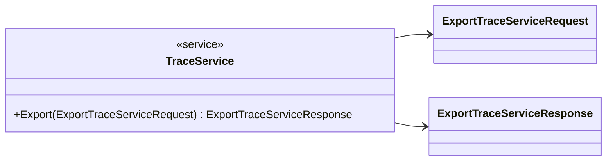
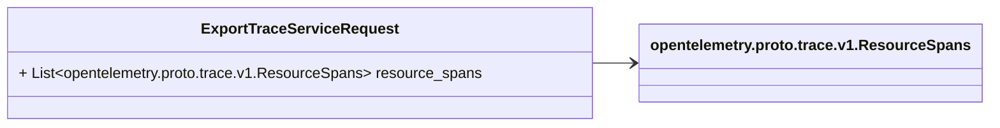
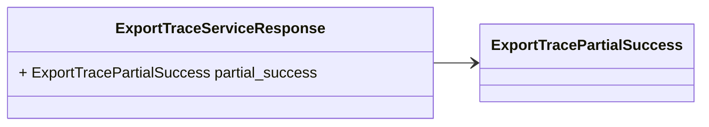
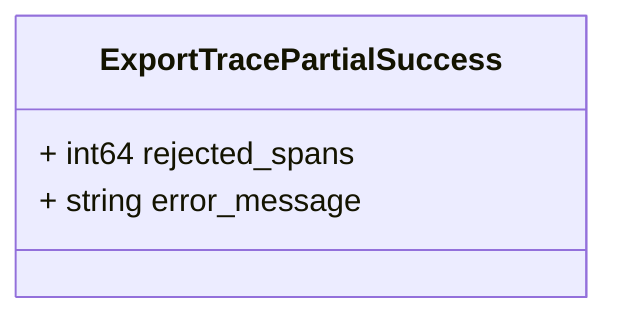

# Package: opentelemetry.proto.collector.trace.v1

Copyright 2019, OpenTelemetry Authors Licensed under the Apache License, Version 2.0 (the "License"); you may not use this file except in compliance with the License. You may obtain a copy of the License at http://www.apache.org/licenses/LICENSE-2.0 Unless required by applicable law or agreed to in writing, software distributed under the License is distributed on an "AS IS" BASIS, WITHOUT WARRANTIES OR CONDITIONS OF ANY KIND, either express or implied. See the License for the specific language governing permissions and limitations under the License. 

## Imports

| Import                                   | Description |
|------------------------------------------|-------------|
| opentelemetry/proto/trace/v1/trace.proto |             |

## Options

| Name                 | Value                                             | Description |
|----------------------|---------------------------------------------------|-------------|
| csharp_namespace     | OpenTelemetry.Proto.Collector.Trace.V1            |             |
| java_multiple_files  | true                                              |             |
| java_package         | io.opentelemetry.proto.collector.trace.v1         |             |
| java_outer_classname | TraceServiceProto                                 |             |
| go_package           | go.opentelemetry.io/proto/otlp/collector/trace/v1 |             |

## Service: TraceService

FQN: opentelemetry.proto.collector.trace.v1

Service that can be used to push spans between one Application instrumented with OpenTelemetry and a collector, or between a collector and a central collector (in this case spans are sent/received to/from multiple Applications). 

### TraceService Diagram

| Method | Parameter (In)            | Parameter (Out)            | Description                                                                                                |
|--------|---------------------------|----------------------------|------------------------------------------------------------------------------------------------------------|
| Export | ExportTraceServiceRequest | ExportTraceServiceResponse | For performance reasons, it is recommended to keep this RPC alive for the entire life of the application.  |

### ExportTraceServiceRequest Diagram

### ExportTraceServiceResponse Diagram

### ExportTracePartialSuccess Diagram

## Message: ExportTraceServiceRequest

FQN: opentelemetry.proto.collector.trace.v1.ExportTraceServiceRequest

 

| Field          | Ordinal | Type                                       | Label    | Description                                                                                                                                                                                                                                                                                                                   |
|----------------|---------|--------------------------------------------|----------|-------------------------------------------------------------------------------------------------------------------------------------------------------------------------------------------------------------------------------------------------------------------------------------------------------------------------------|
| resource_spans | 1       | opentelemetry.proto.trace.v1.ResourceSpans | Repeated | An array of ResourceSpans. For data coming from a single resource this array will typically contain one element. Intermediary nodes (such as OpenTelemetry Collector) that receive data from multiple origins typically batch the data before forwarding further and in that case this array will contain multiple elements.  |

## Message: ExportTraceServiceResponse

FQN: opentelemetry.proto.collector.trace.v1.ExportTraceServiceResponse

 

| Field           | Ordinal | Type                      | Label | Description                                                                                                                                                                                                                                                                                                                                                                                                                                                                                                                                                                                                                                                                                                                                                                             |
|-----------------|---------|---------------------------|-------|-----------------------------------------------------------------------------------------------------------------------------------------------------------------------------------------------------------------------------------------------------------------------------------------------------------------------------------------------------------------------------------------------------------------------------------------------------------------------------------------------------------------------------------------------------------------------------------------------------------------------------------------------------------------------------------------------------------------------------------------------------------------------------------------|
| partial_success | 1       | ExportTracePartialSuccess |       | The details of a partially successful export request. If the request is only partially accepted (i.e. when the server accepts only parts of the data and rejects the rest) the server MUST initialize the `partial_success` field and MUST set the `rejected_<signal>` with the number of items it rejected. Servers MAY also make use of the `partial_success` field to convey warnings/suggestions to senders even when the request was fully accepted. In such cases, the `rejected_<signal>` MUST have a value of `0` and the `error_message` MUST be non-empty. A `partial_success` message with an empty value (rejected_<signal> = 0 and `error_message` = "") is equivalent to it not being set/present. Senders SHOULD interpret it the same way as in the full success case.  |

## Message: ExportTracePartialSuccess

FQN: opentelemetry.proto.collector.trace.v1.ExportTracePartialSuccess

 

| Field          | Ordinal | Type   | Label | Description                                                                                                                                                                                                                                                                                                                                                                                                |
|----------------|---------|--------|-------|------------------------------------------------------------------------------------------------------------------------------------------------------------------------------------------------------------------------------------------------------------------------------------------------------------------------------------------------------------------------------------------------------------|
| rejected_spans | 1       | int64  |       | The number of rejected spans. A `rejected_<signal>` field holding a `0` value indicates that the request was fully accepted.                                                                                                                                                                                                                                                                               |
| error_message  | 2       | string |       | A developer-facing human-readable message in English. It should be used either to explain why the server rejected parts of the data during a partial success or to convey warnings/suggestions during a full success. The message should offer guidance on how users can address such issues. error_message is an optional field. An error_message with an empty value is equivalent to it not being set.  |

<!-- Created by: Proto Diagram Tool -->
<!-- https://github.com/GoogleCloudPlatform/proto-gen-md-diagrams -->
